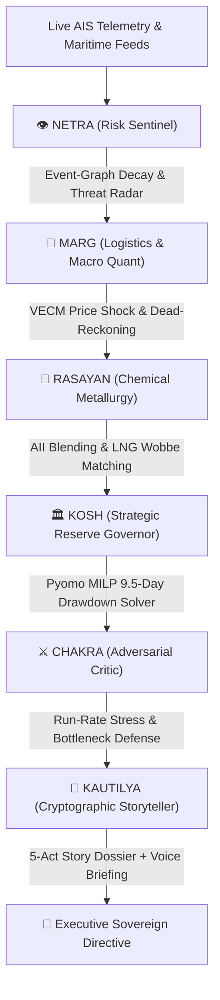

# 🛡️ BHARAT-SHIELD
### AI-Driven Energy Supply Chain Resilience & Sovereign Directive Platform
**Theme**: Supply Chain Intelligence, Energy Security and Geopolitical Risk  
**Corpus / Repository**: [JEETHURIVARUN/BHARAT-SHIELD](https://github.com/JEETHURIVARUN/BHARAT-SHIELD)

---

## 📌 Executive Summary & Problem Context
India imports approximately **88% of its crude oil**, with **40–45% transiting the volatile Strait of Hormuz**. Recent geopolitical disruptions—attacks on Red Sea maritime corridors, sanctions on Iranian exports, and regional standoffs—repeatedly destabilize supply and pricing. Meanwhile, India’s underground **Strategic Petroleum Reserves (ISPRL) cover only ~9.5 days of national consumption**.

Existing enterprise supply chain planning tools cannot model geopolitical risk in real time or coordinate multi-refinery, multi-cavern rerouting under physical and chemical constraints.

**BHARAT-SHIELD** is an AI-powered autonomous directive system that:
1. **Monitors live maritime & geopolitical risks** via AISStream WebSockets and global incident feeds.
2. **Quantifies macroeconomic shocks** using Vector Error Correction Models (VECM) for Brent crude and JKM LNG.
3. **Ensures refinery metallurgical safety** through the non-linear **Asphaltene Instability Index (AII)** across 22 global crude grades.
4. **Optimizes underground salt cavern drawdowns** (Visakhapatnam, Mangaluru, Padur) and commercial stocks via **Pyomo MILP Optimization**.
5. **Red-teams directives for vulnerabilities** and synthesizes tamper-proof, **AI-narrated 5-Act Sovereign Dossiers** with cryptographic SHA-256 validation.

---

## 🏛️ The Sovereign 6-Engine Multi-Agent Mesh



| Engine | Designation | Core Capability |
| :--- | :--- | :--- |
| **NETRA** | Risk Sentinel | Ingests real-time UKMTO incidents, GDELT news, and AIS feeds with exponential temporal decay graph memory. |
| **MARG** | Logistics & Macro Quant | Computes Cape of Good Hope transit delays (+14 days), Dead-Reckoning vessel trajectories, SPM berth limits, and VECM inflation impacts. |
| **RASAYAN** | Chemical Metallurgy | Evaluates 22-grade global crude assays across API, sulfur, TAN, and **Asphaltene Instability Index (AII)** to prevent refinery distillation coking. |
| **KOSH** | Reserve Governor | Executes **Pyomo Mixed-Integer Linear Programming (MILP)** across ISPRL caverns and OMC stocks to preserve national 9.5-day cover. |
| **CHAKRA** | Adversarial Critic | Red-teams the operational plan for refinery run-rate degradation, single-point-of-failure bottlenecks, and product rationing horizons. |
| **KAUTILYA** | Cryptographic Storyteller | Generates tamper-proof SHA-256 execution ledgers, session snapshots, and **interactive 5-Act AI Voice-Narrated Briefings**. |

---

## 🚀 Quick Start & Local Execution Guide

### 📋 Prerequisites
- **Python 3.10+** (Python 3.11/3.12 recommended)
- **Node.js 18+ & npm**
- **Git**

### 1️⃣ Clone the Repository
```bash
git clone https://github.com/JEETHURIVARUN/BHARAT-SHIELD.git
cd BHARAT-SHIELD
```

---

### 2️⃣ Backend Setup (FastAPI + Mathematical Solvers)
Open a terminal in the project root:
```powershell
cd backend

# Create & activate virtual environment
# Windows:
python -m venv venv
.\venv\Scripts\Activate.ps1

# macOS / Linux:
# python3 -m venv venv
# source venv/bin/activate

# Install dependencies
pip install -r requirements.txt

# (Optional) Copy environment template
cp .env.example .env

# Launch FastAPI Server
uvicorn app.main:app --reload --port 8000
```
*Backend runs at:* `http://localhost:8000`  
*Interactive Swagger API Docs:* `http://localhost:8000/docs`

---

### 3️⃣ Frontend Setup (React + Vite + Deck.gl)
Open a **new terminal window** in the project root:
```powershell
cd frontend

# Install dependencies
npm install

# Start Vite Development Server
npm run dev
```
*Open your browser at:* **`http://localhost:5173`**

---

## 🌐 Cloud Deployment Guide (Vercel + Render)

### Deploy Frontend to Vercel (Recommended)
1. Push your code to GitHub.
2. Go to [Vercel](https://vercel.com) and click **Add New Project**.
3. Import the `JEETHURIVARUN/BHARAT-SHIELD` repository.
4. Set **Root Directory** to `frontend`.
5. Under **Environment Variables**, add:
   * `VITE_API_URL` = `https://your-backend-service.onrender.com` (or your hosted FastAPI URL).
6. Click **Deploy**. Vercel will build and host the interactive 3D digital twin.

### Deploy Backend to Render (Free Tier)
1. Go to [Render](https://render.com) and create a **New Web Service**.
2. Connect your GitHub repository.
3. Set **Root Directory** to `backend`.
4. Set **Runtime** to `Python 3`.
5. Set **Build Command** to `pip install -r requirements.txt`.
6. Set **Start Command** to `uvicorn app.main:app --host 0.0.0.0 --port $PORT`.
7. Click **Create Web Service**.

---

## 💡 Live Interactive War Game Scenarios to Try

1. **Red Sea Maritime Escalation (Crude Shortfall)**:
   > *"Houthi drone strike on VLCC near Bab-el-Mandeb. 4.5 MMT crude supply disrupted for Paradip refinery. Recommend full rerouting and emergency drawdown."*
2. **Strait of Hormuz Dual-Commodity Blockade**:
   > *"Hormuz military standoff: 8 MMT crude disrupted at Jamnagar + 12 MMSCMD LNG shortfall at Dahej terminal."*
3. **Ministerial AI Voice Briefing**:
   - After simulation, click **"Authorize Directive"**.
   - Click **"🎙️ AI Voice Narration"** to hear the sovereign executive briefing read aloud.
   - Inspect the **5-Act Story Scenario**, **Action Orders**, and export the **Cryptographic Markdown Dossier**.

---

## 📊 Technical Moats & Scientific Formulations

1. **Non-Linear Asphaltene Instability Index (AII)**:
   $$\text{AII} = \frac{\text{Asphaltenes} + \text{Resins}}{\text{Saturates} + \text{Aromatics}}$$
   Prevents catastrophic flocculation and refinery crude distillation unit (CDU) tray coking when blending spot crudes.

2. **Pyomo MILP Multi-Cavern Optimization**:
   $$\min \sum_{i} \left( C_i^{\text{draw}} \cdot x_i + C_i^{\text{freight}} \cdot x_i + \lambda \cdot (D - \sum x_i)^2 \right)$$
   Subject to daily cavern withdrawal ceilings, OMC commercial minimum working inventories, and SPM pipeline evacuation limits.

3. **Vector Error Correction Macro Shock (VECM)**:
   Quantifies cointegrated long-run Brent/JKM pricing dynamics and maps direct basis-point impact to India's CPI inflation and GDP growth.

---

## 🛡️ License & Sovereign Mandate
Developed for the National Energy Security & Supply Chain Resilience Hackathon.  
© 2026 BHARAT-SHIELD Team · Strategic Autonomy for Bharat.
